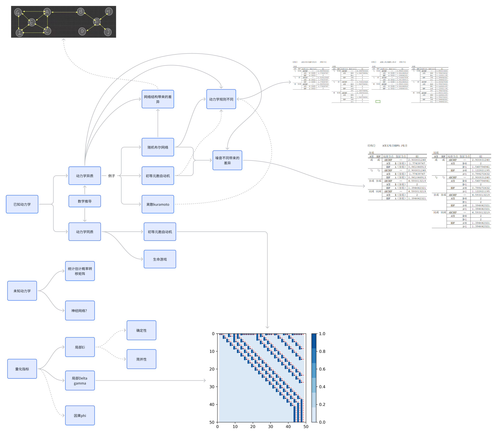

# Local causal emergence 
There are codes for calculating and identifying local causal emergence.

# Functions of folders
func: The function files used for calculating effective information.  

      EI_calculation: The function used to calculate EI. 

      p_calculation: The function used to calculate the probability value of one note. 

exp: The running code for the experiments presented in the project.  

resources: The image files.  

